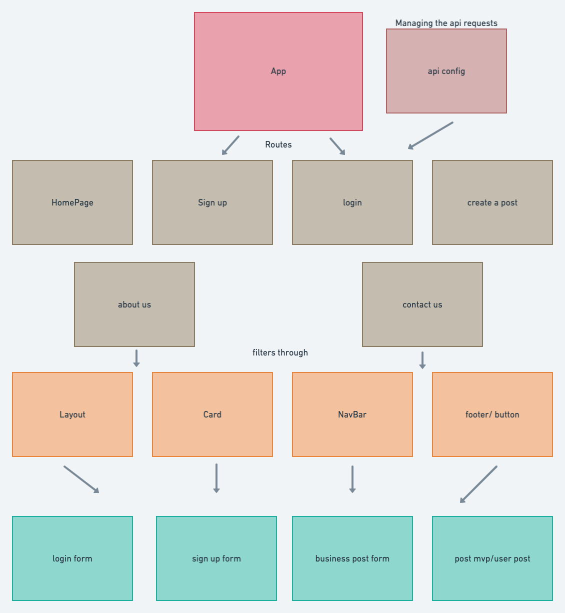

# VolunteerApp

## Team Rockit


#

## Overview

#

Allow businesses to post needs for volunteers. And allow users to sign up for those events. Users and businesses will have separate account types and have different auth for types of posts they can create or comment on.

#

## Schemas

```

new User schema {
	userName: “”,
	Email: “”,
	Password: “”,
	Confirm password: “”,
	isBusiness: true or false,
	Businesname: “”,
	Posts: [postSchema]
}

New post schema {
	title/event: “”,
	body/content: “”,
	numberNeeded: number,
	Comment: [comment schema]
}

new Comment schema {
	Likes: number,
	Body: “”
}
```

#

## Whimsical



#

## Team Expectations

[Team Expectations](https://docs.google.com/document/d/1OMbooy7ycTiZydVZ8s6fbFBqBXZppMoQVW1LQgrxV6M/edit?usp=sharing)

This defines what each member will be responsible for as well as the coding practices everyone will be expected to follow. This will help create a work flow that will be easy and healthy for everyone involved.

#

## GitHub Project Board

This contains a list of our MVP's and post-MVP's. Each person will be assigned something that is posted on the to-do list. When that person starts to work on it, they will drag it from the to-do into the in progress board. Once they have finished this they will put it in the done board and delete the assignment entry in the assignment board. As the project becomes clearer things may be added to the to-do list. Before assigning someone a task we will check in with each other if thats okay.

[GitHub Project Board](https://github.com/users/ImmanuelCurrah/projects/1/views/1)

#
